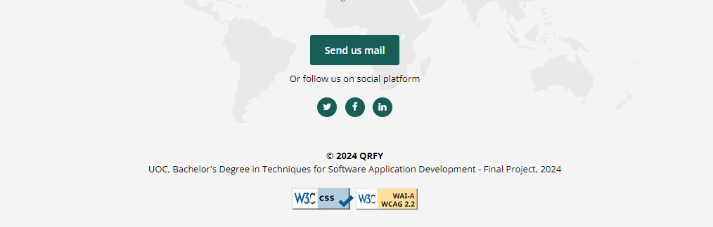
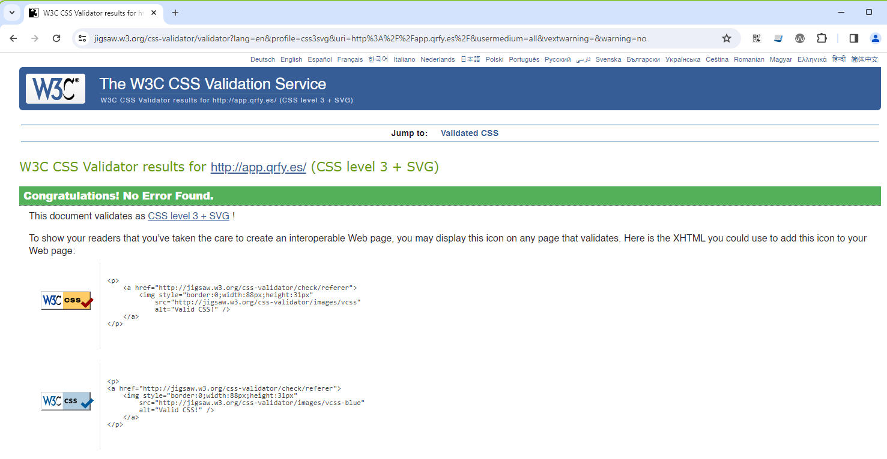
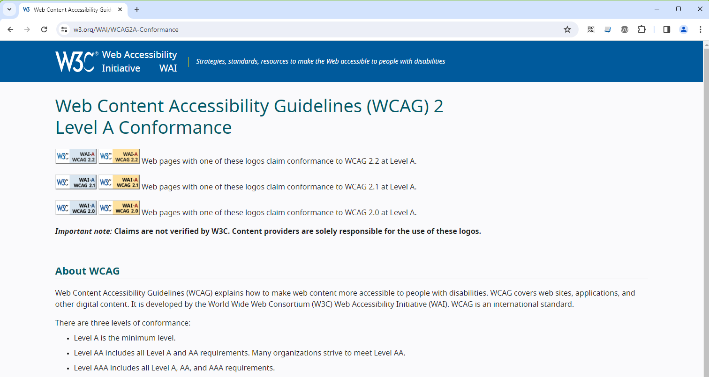
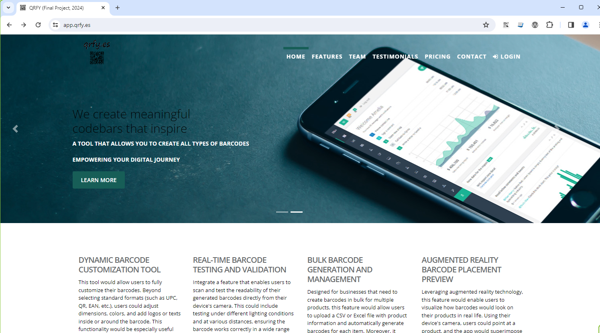
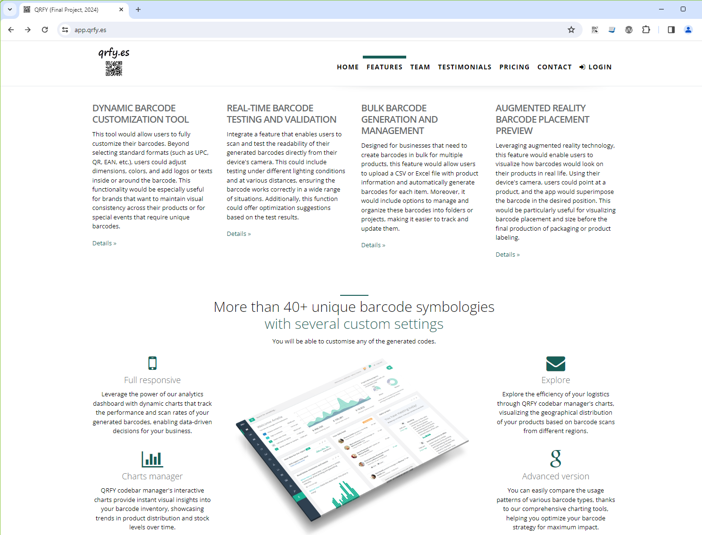
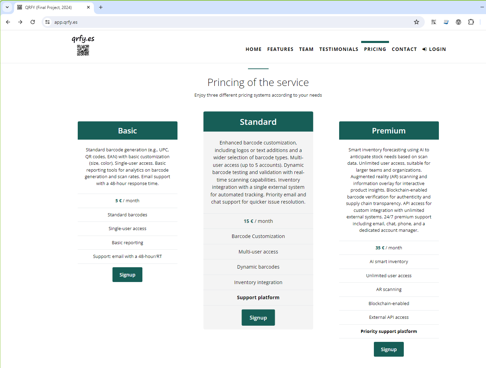
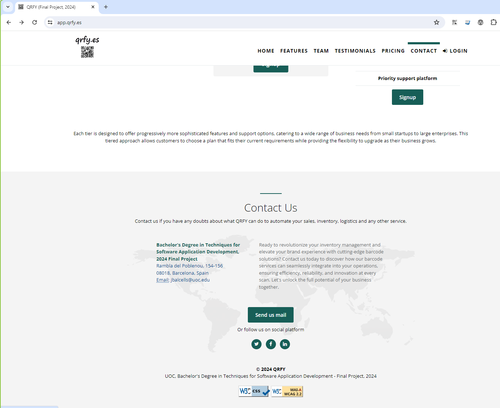

<!-- PROJECT LOGO -->
 

  
  <h3 align="center">README.MD</h3>

  

    This repository contains the source code of the project's main landpage accessible at https://app.qrfy.es
     
  

<!-- TABLE OF CONTENTS -->

  
Table of contents

  <ol>
    <li><a href="#description">Description</a></li>
    <li><a href="#accessibility">Accessibility considerations</a></li>
    <li><a href="#screenshots">Screenshots</a></li>
  </ol>

<!-- DESCRIPTION -->
## Description

This page is a standalone web page created specifically for a marketing or advertising campaign. It's where a visitor "lands" after they click on a link in an email, ads from Google, Bing, YouTube, Facebook, Instagram, Twitter, or similar places on the web. Unlike web pages, which typically have many goals and encourage exploration, landing pages are designed with a single focus or goal, known as a call to action (CTA). This focus makes landing pages the best option for increasing the conversion rates of your marketing campaigns and lowering your cost of acquiring a lead or sale. 

>QRFY offers a comprehensive suite of barcode solutions aimed at transforming businesses through advanced, customizable barcode creation, real-time testing and validation, and bulk management features. It leverages augmented reality for barcode placement previews and offers over 40 unique barcode symbologies. The platform is designed to enhance inventory management, offering features like dynamic charts for performance tracking, seamless API integration, and advanced support for efficient inventory management and data-driven decision-making. Pricing options cater to various business needs, ranging from basic to premium services.

>All mentioned data are fictitious but according to the theme of the project representing a real means of access to the backend through the "Login" button.

<!-- ACCESSIBILITY -->
## Accessibility considerations

This project complies with all WCAG 2.0 accessibility standards and has been verified through W3C (World Wide Web Consortium) tools such as "W3C CSS Validation Service" or "Web Content Accessibility Guidelines (WCAG) 2.2 Level AA Conformance".

    

        
    

     
    

        
    

    

        
    

<!-- SCREENSHOTS -->
## Screenshots

    

        
    

     
    

        
    

     
    

        
    

     
    

        
    

